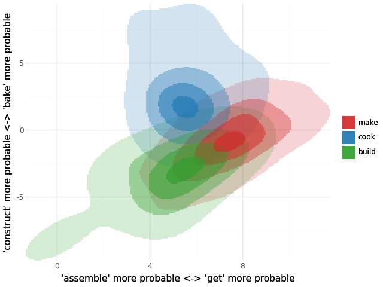

# semShape: The Shape of Language

A framework for distilling distributional semantics from a language model as a continuous probability density, rather than as a fixed-size table of co-occurrence counts.

## What and Why

A trained LLM, run over a corpus, emits a probability distribution over its vocabulary at every position. Each such distribution is a point on the probability simplex $Δ^{V−1}$ (since probability distributions are constrained to sum to 1, the simplex has one fewer dimension than the vocabulary $V$). The set of all those points, accumulated over a corpus, is a density $g(y)$ — a continuous object that captures the full range of the LLM's distributional-semantic expressivity, without collapsing to per-token averages. semShape analyses this density and the per-token reweightings $g(y|t) ∝ p_t(y) · g(y)$ derived from it. This is interesting for a few reasons:

### Word Embeddings as Summaries of a Continuous Distribution

word2vec, GloVe, and other similar word embedding methods are all, in essence, low-rank factorizations of a (shifted) PMI matrix whose entries are $PMI(t, w) = log p(w | t) − log p(w)$ [@levy2014]. The continuous framework computes the same object but from the LLM's *predicted* probabilities (or windowed moving averages of these) rather than raw corpus counts:

$$PMI(t, w) = log E[p_w | t] − log E[p_w]$$

Because the LLM smooths over rare contexts via its learned generalization, this method of computing PMI is a much lower-noise estimator of distributional structure than counting, especially for rare tokens or rare pairs. Working with this estimator, many theoretically questionable hacks used in traditional word embedding models [e.g. context distribution smoothing, subsampling, zeroing negative PMI values; see @levy2015] are rendered unnecessary. SVD on the resulting PMI matrix recovers static word embeddings of the same flavor as word2vec, but with much cleaner theoretical interpretation.

Since probability distributions are constrained to sum to 1, the meaningful notion of distance between two probability distributions is a function of their *log-ratios*, not their absolute differences. ILR (isometric log-ratio) is an orthonormal basis that puts log-ratios into ordinary Euclidean coordinates. In other words, linear directions in ILR-space correspond to the log odds of observing one token (or group of tokens) over another in a given context, with zero corresponding to equal probability. This means that semShape embeddings can be easily visualized using intuitively interpretable axes, like this:



Once again, these embeddings live in a space that is nearly analogous to that of classic word embeddings like word2vec and GloVe. This is because both shifted PMI (the classic word embeddings approach) and ILR are log-ratios. In fact, under the ILR basis $Ψ$, a row of the PMI matrix can be expressed simply as a difference in ILR-space means: $Ψ · PMI_t = E[Y | t] − E[Y]$ where $Y = ILR(softmax-output)$.

An added bonus of distilling log-ratio embeddings from an LLM is that the LLM has *already* done the necessary dimensionality reduction during training. More specifically, $ILR ∘ softmax$ is affine in the LLM's final hidden state $h$, so $Y = Ah + c$ for $A = ΨW$. This collapses the working dimension from V−1 to the model's embedding dimensionality, making the whole pipeline tractable at large vocabulary sizes.

### Two Types of Polysemy

A beautiful consequence of this approach to word embeddings is that *polysemy comes out of the density shape itself*. Existing multi-sense embedding methods cluster context vectors with a pre-specified $K$. Here, each token's reweighted density $g(y | t)$ is a real distribution whose modes can simply be counted:

$$         
g(y | t) = Σ_k π_{t,k} · g_k(y | t)$$

Each component $g_k$ is a sense; $π_{t,k}$ is its relative frequency; $ν_{t,k} = E_{g_k}[Y]$ is a sense-specific embedding. A standard word2vec embedding $μ_t = E[Y | t] = Σ_k π_{t,k} · ν_{t,k}$ is, in this view, a mixture-average of sense embeddings. Polysemy analysis amounts to unmixing what averaging collapsed.

The covariance of $Y | t$ then decomposes (law of total variance) into two geometrically distinct contributions to the overall spread of a token's distributional behavior:

$$Cov[Y | t] = \underbrace{Σ_k π_{t,k} · Σ_{t,k}}_{\substack{\text{within-sense} \\ \text{flexibility}}} + \underbrace{Σ_k π_{t,k} · (ν_{t,k} − μ_t)(ν_{t,k} − μ_t)^T}_{\substack{\text{distinct} \\ \text{senses}}}$$

These two are orthogonal: a token can have a single sense used flexibly across many contexts (high within-sense variance, low between-sense), or several sharp homonymous senses (the reverse), or both. The continuous framework gives this distinction a precise quantitative form, where discrete co-occurrence vectors collapse it into a single point.

### The Shape of a Language

In this view of polysemy, the meaning distributions of distinct tokens can overlap with one another. This is intuitively correct: The word "make" in certain contexts can have an almost identical meaning to the word "cook". In other words, this region of semantic meaning is sometimes occupied by the token "make" and sometimes by the token "cook". With this perspective, it makes perfect sense to zoom out from the overlapping regions occupied by individual tokens and consider the set of all possible distributional semantic meanings in the language. This is the global semantic manifold $g(y)$ — a single probability distribution that captures the space of meanings independent of what particular token may inhabit them. Thus the lexical semantics of a given language (or cultural sublanguage represented by a corpus) can be said to have a single shape — the shape of this manifold.

The semShape framework opens the door to many interesting constructs derived from the shape of the global semantic manifold. For example, distinctiveness field $D_t(y) = log[g(y|t)/g(y)]$ represents the degree to which a given meaning is distinctive of a particular token, and the expected value of this field, $D_t = D_{KL}(g(·|t) ‖ g(·))$, represents the overall semantic distinctiveness of a given token relative to the language as a whole.

semShape also opens the door to new methodologies investigating the shape of the global semantic manifold: To what extent is this shape stable across languages? How does the shape change in the wake of conceptual restructuring of the language community (e.g. a theoretical paradigm shift in a scientific field)? Is it easier to learn novel words with distributional meanings that fall on the manifold than words with meanings that fall off it?

## Repo Layout

```
shape/                 the framework — see API below
scripts/               CLI wrappers around shape/ for each pipeline stage
tests/                 pytest suite for shape/
out-<dataset>/         training checkpoints (ckpt.pt + meta.pkl)
features/<dataset>/    Stage-1 outputs (samples, Z, meta)
models/<dataset>/      Stage-2 normalizing-flow checkpoints
embeddings/            Stage-3 static-embedding .npz files
train.py, model.py     LLM training (nanoGPT with rotary / RMSNorm / SwiGLU)
manim/                 explanatory visualization
```

`train.py` and `model.py` are a lightly modernized nanoGPT [@karpathy2025]; the project's contributions are in [shape/](shape/) and the scripts that drive it.

## Pipeline and API

1.  **LLM Training**: `path/to/<dataset>/` → `train.py` → `out-\<dataset\>/ckpt.pt`
2.  **Corpus Run**: `shape.extract.extract_features` → `features/<dataset>/` (one predictive state per position, optionally window-averaged: hidden states $h$, or probability vectors for probability-space averaging)
3.  **Visualization**: `shape.viz` → density plots
4.  **Static Embeddings**: `shape.embeddings.compute_embeddings` → `embeddings/<dataset>/` (static embeddings analogous to word2vec) → `shape.embeddings_benchmarks`
5.  **Global Density Estimation**: `shape.density.fit_flow` → `models/<dataset>/` (Neural Spline Flow fit on $h$)
6.  **Distinctiveness Analysis**: `shape.distinctiveness.compute_distinctiveness` → `distinctiveness/<dataset>/` (distinctiveness scores)
7.  **Polysemy Analysis**: `shape.polysemy.analyze_polysemy` → `polysemy/<dataset>/` (mixture model results)

CLI entry points (each is a thin wrapper around the corresponding `shape/` function — see `--help` on any of them):

``` bash
python scripts/extract_features.py  --ckpt out-coca/ckpt.pt \
                                    --data path/to/coca/test.bin \
                                    --out-dir features/coca --dataset coca_test
python scripts/fit_density.py       --h features/coca/coca_test_h.npy \
                                    --out models/coca/coca_test_flow.pt
python scripts/compute_embeddings.py --ckpt out-coca/ckpt.pt --features-dir features/coca \
                                    --dataset coca_test --out embeddings/coca_test_emb.npz
python scripts/compute_similarity.py --ckpt out-coca/ckpt.pt \
                                    --vocab path/to/coca/meta.pkl \
                                    --samples features/coca/coca_test_h.npy \
                                    --input pairs.csv --output pairs_with_sim.csv
```

The `scripts/discrete_*.py` pair (`discrete_build_fcm.py`, `discrete_full_predictions.py`) implements the count-based FCM+PMI baseline against which the continuous pipeline can be compared.

### `shape/` modules at a glance

| Module | Role |
|------------------------------------|------------------------------------|
| [`geometry.py`](shape/geometry.py) | ILR basis (Helmert SBP), `ILR_apply` / `ILR_apply_T`, `compute_A` (= ΨW), and the experimental `degenerate_direction` / `project_h`. All cumsum-based — never materializes the (V−1)×V basis. |
| [`windowing.py`](shape/windowing.py) | Decay-weight tables for context-window averaging (linear / harmonic / exponential / power), shared with the discrete FCM pipeline. Supports a `tokens_per_minute` parameter for converting token distances to elapsed time before applying power-law decay. |
| [`extract.py`](shape/extract.py) | Stage 1. Streams the corpus through the LLM and emits one predictive state per position plus the marginal $Z_w$. Window averages are taken either over hidden states (`averaging='aitchison'`, the default: the Aitchison centroid of the per-position distributions, stored compactly as $h̄ ∈ ℝ^d$) or over probabilities (`averaging='probability'`: the probability of each token within the window, stored as $V$-dimensional float16 vectors). `iter_window_states` exposes the same pass as a generator. Supports memmapped output and reservoir subsampling for COCA-scale runs. |
| [`samples.py`](shape/samples.py) | Reads stored samples in either format: `iter_sample_probs` yields probability batches from hidden states (given $W$) or stored probabilities, so downstream estimators are format-agnostic. |
| [`density.py`](shape/density.py) | Stage 2. Fits a Zuko Neural Spline Flow on standardized hidden states $h$ for $g̃(h)$; provides `log_density` and `sample`. |
| [`embeddings.py`](shape/embeddings.py) | Stage 3. Moment matrix $M[t,w] = E[p_t·p_w] → PMI → optional\ Ψ → SVD → (V, k)$ embedding, from stored samples of either format or a streaming corpus pass; plus `nearest_neighbors`. |
| [`embeddings_benchmarks.py`](shape/embeddings_benchmarks.py) | Psycholinguistic benchmark evaluation for static word embeddings. |
| [`viz.py`](shape/viz.py) | Token-conditional density plots. Three bases: token-specific weighted PCA, global PCA, and user-specified token-pair contrasts (axes = log-odds of one token vs. another). Two views: model (importance-weighted) and empirical (filtered by next-token id). |
| [`similarity.py`](shape/similarity.py) | Pairwise probability-theoretic similarity between token pairs: expected probability $E[p_{t_2} \mid t_1]$, expected surprisal $-E[\log p_{t_2} \mid t_1]$, and KL divergence $D_{KL}(g(\cdot\mid t_1)\Vert g(\cdot\mid t_2))$. All quantities are importance-weighted expectations; two entry points cover stored samples (either format) and a streaming corpus pass with either averaging geometry. |
| [`distinctiveness.py`](shape/distinctiveness.py) | Measures the distinctiveness of tokens in the embedding space. |
| [`polysemy.py`](shape/polysemy.py) | Analyzes the polysemy of tokens in the embedding space using mixture models. |

### Working with Cached Features

`shape.extract.valid_positions(meta)` maps memmap rows to corpus indices. `viz`, `density` and `polysemy` work in hidden-state space and therefore need `{name}_h.npy` samples (no window or `averaging='aitchison'`). `shape.viz` builds a working subsample with cached `log_Z_of_h` so that $p_w(h_i)$ is an O(d) query per token, which is what makes interactive polysemy plotting tractable.

# References